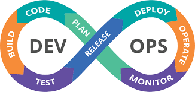
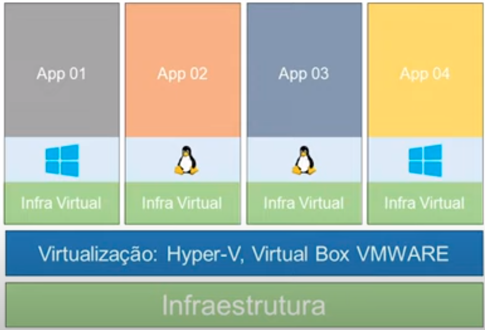
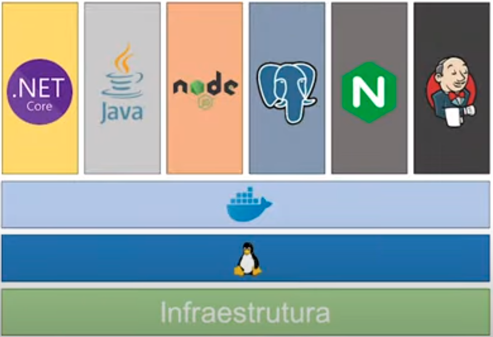
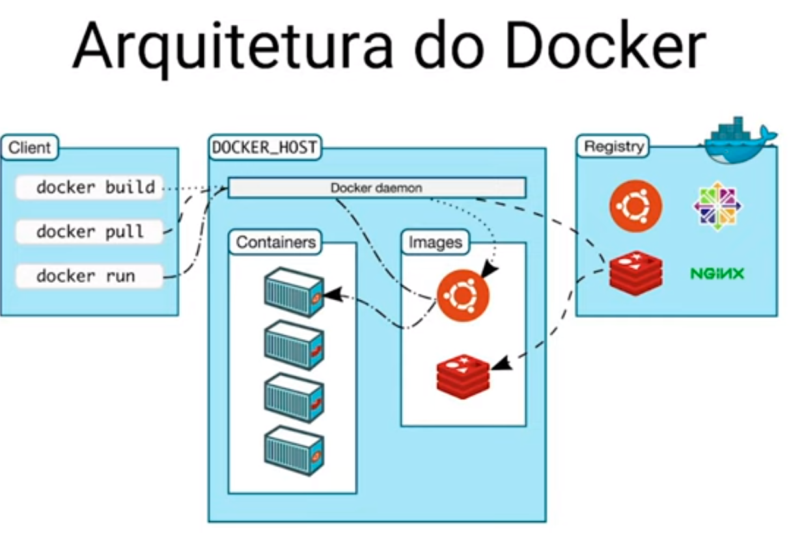

# Iniciativa DevOps Junho/2022

## Aula 1 - Seus primeiros passos no Universo DEVOPS + DOCKER

### Ciclo DEVOPS


### Virtualização


### Conteinerização


### Arquitetura do Docker


### Primeiros passos com Container

#### Comandos para tarefas mais comuns

_Executar um Container_ 
```
docker container run hello-world
```

_Listar Containers em execução_
```
docker container ls
```

_Listar Containers em modo "EXITED"_
```
docker container ls -a
```

_Listar Container mostrando apenas seu ID_
```
docker container ls -a -q
```

_Executar Container atribuindo um nome_
```
docker container run --name NomeParaContainer hello-world
```

* *_Neste caso irá gerar um Container cujo nome será NomeParaContainer com a imagem hello-world_*

_Excluir Container_
```
docker container rm NomeDoContainerQueSeraRemovido
ou
docker container rm IdDoContainerQueSeraRemovido
```

_Executar Container e em seguida removê-lo_
```
docker container run --rm hello-world
```

* *_Muito utilizado em processos pontuais_*

_Executar um Container em modo Interativo_ 
```
docker container run -it ubuntu /bin/bash
```